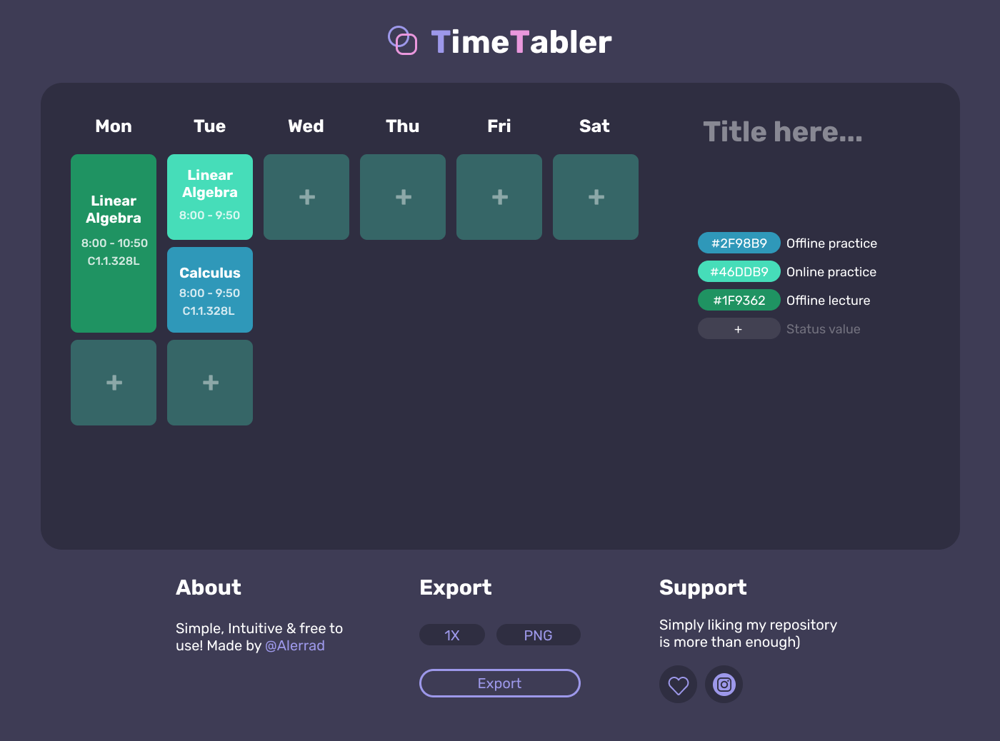

# __Time-tabler__ 📅

## About
Easy to use a web app/tool for creating beautiful scalable weekly timetables with different styles and some other cool additional features.

## Possibilities
Overall, it lets you create and organize your timetables for different needs, whether it’s for school, work or any other thing.

__You can__:
- Customize it however you want;
- Export your timetable as .png, .jpeg and .pdf;

## Limitations
- You are not allowed to put a license on any image that was exported from this tool;
- Currently, it is not possible to create more than 10 blocks on a single column;
- Currently not supported on mobile devices;

## Little backstory
I came up with this idea when I was dealing with multiple requests from my friends from other groups to design a timetable like mine for them. I also had to make a project for my end-term exam for a "front-end" subject (I didn't wanna go with something classy and boring like an e-commerce or personal web page). So, therefore, I decided to create something so little and so handy at the same time like this for everyone.